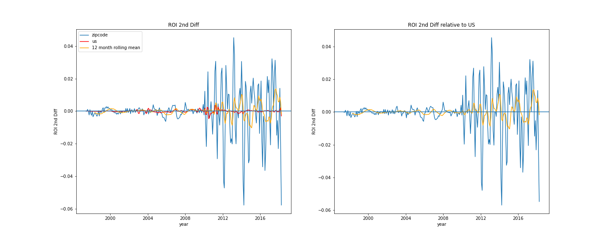
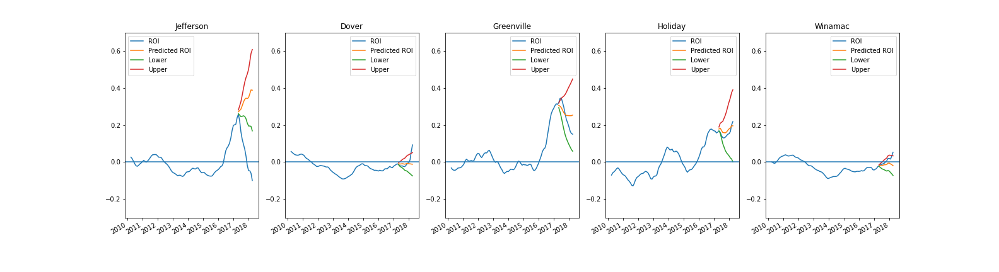
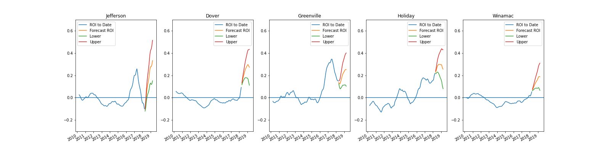
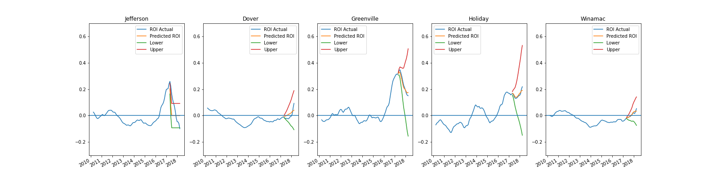
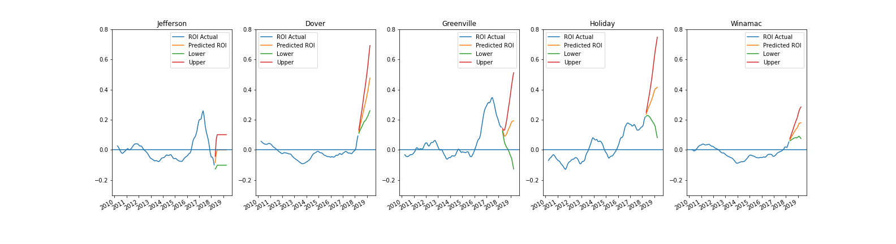

# Real Estate Investment - Finding Markets with High Short Term Growth.

In this project, I use SARIMA modeling to predict high growth zipcodes for the period from April 2018-April 2019. The metric I use to determine high growth is the predicted year over year return on investment for a zipcode at the end of that period.

## The Data

The dataset I used for this project included median home prices for all zipcodes in the US between 1996 and 2018 - 14,723 zipcodes. Because around a thousand of these zipcodes did not have information for this entire period, I eliminated them from the dataset.

### Feature Engineering

In order to model the data, I engineered three features.

- Year over Year Return on Investment (ROI): calculated as (Current Month Median Home Price - Median Home Price 1 year ago)/(Median Home Price 1 year ago)

- ROI First Difference: Current Month ROI - Previous Month ROI

- ROI Second Difference: Current Month First Difference - Previous Month First Difference

I then detrended each of these features by taking the value of each feature for each zip code and subtracting from that value the value for the US as a whole. 

### Selecting zipcodes for training

I selected 20 zipcodes for training:

1. Top 5 valued zipcodes by highest 12 month rolling average
2. Top 5 ROIs by highest 12 month rolling average
3. Top 5 ROI First Difference by highest 12 month rolling average
4. Top 5 ROI Second Difference by highest 12 month rolling average

### EDA Result 1: Limit Training Data to post 2010

For each of the #1 zipcodes in each category, I looked at plots based on each of the four metrics. Plots for ROI First Difference and ROI Second Difference showed a marked difference in patterns after 2010 as we see in the plot for Newark's ROI Second Difference below. After this date, the frequency of oscillations in first difference increased, as did the variance of second differences. Since dates before 2010 clearly exhibit patterns that are no longer present in the real estate market, I limited my training data to the post-2010 period.

### EDA Result 2: Near Uniformity of ACF and PCF results

ACF and PCF plots for the #1 zipcodes in each of the four categories show a uniform pattern:

- Without differencing, there was a slow decline in autocorrelation through lag 4 or 5 and a diminishing oscillation in partial autocorrelation through lag 4.
- With First differencing, there was autocorrelation through lag 2 and a diminishing oscillation in partial autocorrelation through lag 3 or 4
- Second differencing was most inconsistent, though in almost all cases there was a positive autocorrelation at lag 1 followed by a negative autocorrelation at lag 2. 
- First and second differencing shows consistent negative correlation at lag 12.

These results indicate that to model these zipcodes at least 1 differencing is needed as well as either a second differencing or additional terms at lags 1 and 2, and a seasonal term at lag 12. Furthermore, plots of first and second difference show that a single differencing is effective in stationarizing the data as long as we confine ourselves to post-2010 dates.

### Model Building

I decided that instead of building a different model for each zipcode, I would try to build a single model validated on all of them. The reason I decided to do this was because the ACFs and PCFs of these zipcodes seemed similar enough that a single set of features might be effective in modeling each of them. Furthermore, a model validated on multiple zipcodes is less likely to be overfit than a model validated on only a single zipcode.

### Model Validation Process

My model validation process was as follows: For each zipcode, I trained the model on the period from April 2010 through April 2017 and recorded the mean standard error for the model's predictions on the period from May 2017-April 2018. In other words, model were specifically tested for their performance over a one year period. 

To evaluate a model's overall performance I took the average standard error for all twenty zipcodes.

### Baseline Model

I first tested a baseline AR(1) Model. The model's average standard error was 0.14. Error was lowest for the high value zipcodes and highest for the zipcodes with the highest ROI First Difference. 

### Optimizing Features

I next ran through a grid of features to find the model that minimized average standard error for all twenty zipcodes.

I tested all permuations of values of p, d, and q from 0 through 2 and values of ps12 ds12 and qs12 of 0 and 1. This meant testing 216 total models on twenty different zipcodes. 

The best performing model included SARIMA features (1, 1, 2)x(1, 0, 1, 12) and yielded an average Standard Error of 0.11. As with the baseline model, errors were lowest for the high value zipcodes and highest for the high First Difference zipcodes. However, error improved drastically for the high first difference zipcodes, while increasingly slightly for the high value zipcodes.

### A Universal Model?

The generally low level of error for this set of features raised the possibility that these features could be used to effectively model ROI for any zip code. If this is the case, then we could train this model on every zipcode in the country, use each trained model to make a one year-out prediction and determine which zipcodes have the best prediction. 

### Using the universal model to forecast five high performing zipcodes

Since I wanted to select zipcodes that balanced high predictions with low risk, I selected the best performing zipcodes based on the lower boundary of the model's 95% confidence interval for the final forecasted date (2019-04-01). 

This process took several hours, but ultimately output a list of predicted means and lower confidence intervals, of which I selected the top 5 for further analysis. For these top five zipcodes the average standard error was 0.32, much greater than the standard error of 0.11 for the twenty zipcodes previously studied. This large error was caused by a single zipcode with a standard error of 1.08. Without this high error zipcode, the model's standard error would have been 0.12. 

Below are predictions given by the (1, 1, 2)x(1, 0, 1, 12) model for the 2017-2018 period compared with true values for that same period.

And here are the forecasts for the 2018-2019 period:

### Can the Universal Model be Trusted?

Because these five zipcodes were picked out specifically for their high performance on the universal model, we need to determine whether their high predicted ROI values are the result of selection bias or whether modeling on another set of features would be just as likely to produce impressive results.

### Feature Selection 2: Custom Features

For this group of five zipcodes, I then performed feature selection for each zipcode individually, using grid search on SARIMA features to determine the model that would produce the smallest standard error for each zipcode. Standard errors were extremely small- 0.03 on average, which is unsurprising since  each model was optimized based on its performance on a single zipcode rather than on a set of twenty zipcodes. 

Below are predictions for 2017-2018 based on custom models compared with true values.

And here are forecasts for 2018-2019 base on the customs models:

### Three Models

I end the study by evaluating the performance of three methods for predicting ROI:

1. The universal model, with one set of SARIMA features selected for their performance on twenty different zipcodes
2. The custom model, with a separate set of SARIMA features for each zipcodes
3. An simple averaging method, which predicts ROI as the average of the value predicted by the Universal Model and the value predicted by the zipcode's custom model

### Evaluating the three models

I evaluated these three models by using them to calculate first ROI and finally price predictions for April 2019 for each of the five zipcodes that I used for custom modeling. I then calculated standard error for each of these methods based off of actual median home values for April 2019 obtained through Zillow's website. 

It turned out that based on Zillow's 2019 data, the universal model method had the lowest standard error ($51,571), the custom model method had the highest standard error ($74,866), and the combination method had a middling standard error ($55,294).

My conclusion was that the custom models were inferior to the universal model because they had been validated on only a single zipcode, whereas the universal model was superior because it had been validated on twenty zipcodes.

### Recommendation

Because of the superior performance of the (1, 1, 2)x(1, 0, 1, 12) SARIMA model, I would recommend it as the best of the methods examined here for forecasting future ROI. However, the fact that two out of the three zipcodes had 2019 median home prices that fell below prices that were predicted with 97.5% confidence, indicates that we should still strive for improvement.

### Further Investigations

One potential source of error may be that we performed our feature grid search based on zipcodes that had recent indicators of high performance. 

A better approach to finding a universal model might be to validate feature selection based on a random set of twenty zipcodes.

Another possibility is that there may be multiple good models -- and that different types of real estate market are best modeled by different sets of features. The question then is how to identify these types of market. One method might be to categorize markets by ROI variance, while another might be to categorize markets based on their covariance with the US market as a whole. By comparing the error of the models selected for each of these categories with the error for a model selected based on a random selection of zipcodes, we could evaluate the information gained by deploying a larger number of models.
